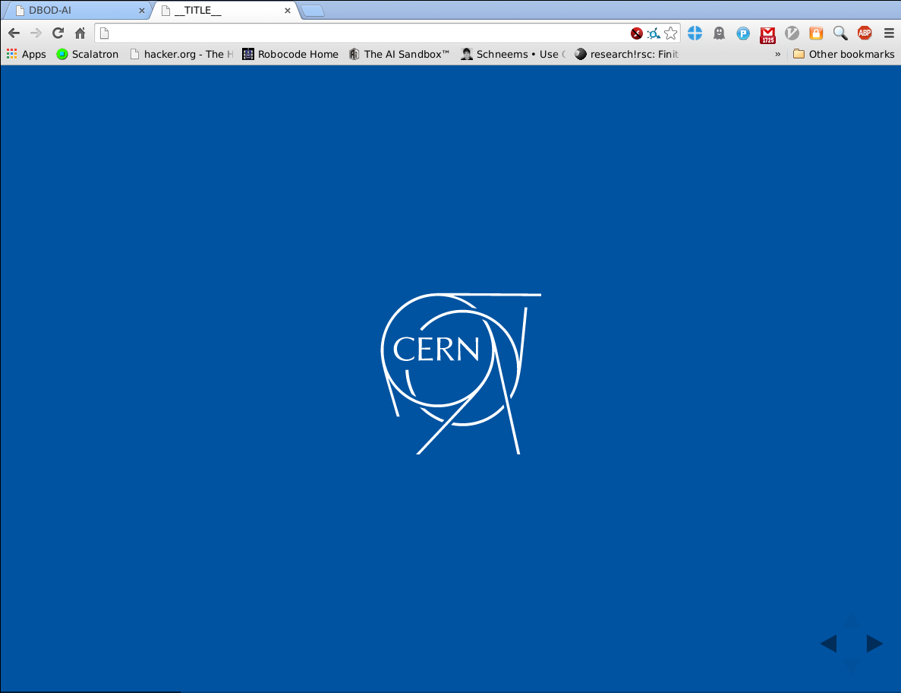
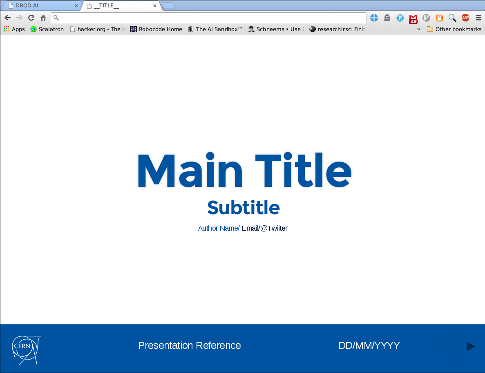
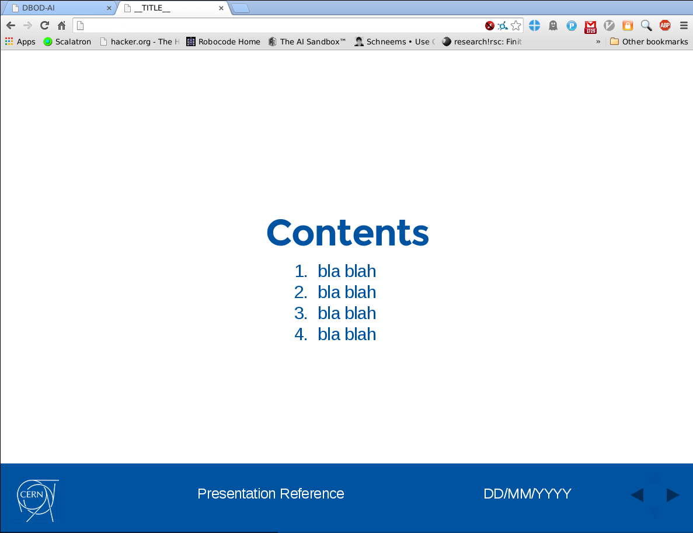
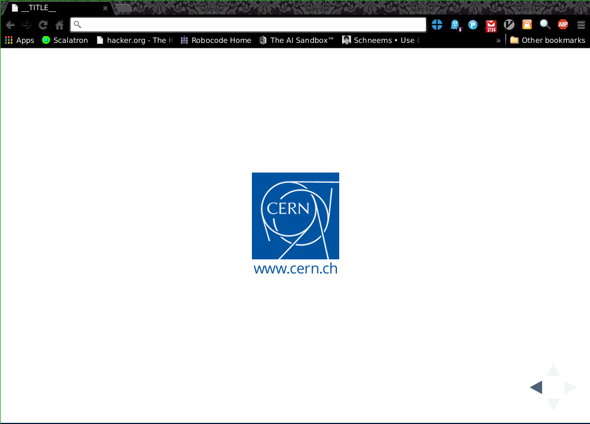

revealjs-cern
=============

A [Reveal.js](http://lab.hakim.se/reveal-js/#/) theme trying to follow the official [CERN] (www.cern.ch) template for presentations as shown 
[here] (http://design-guidelines.web.cern.ch/presentations).

[CERN] (www.cern.ch) is the source of the images used as ghaphic resources for this theme, and retains the sole
copyright of all related imagery.

#### TODO

* Improve the footer CSS
* Change fonts?
* Adjust size of badges in Top and Tail slides
* Add style for customizable templates (currently only the 'strictly CERN' template is replicated

### Instructions

Anyone using [Reveal.js](http://lab.hakim.se/reveal-js/#/) should know how to use this and should be able to place any file wherever they want.
If you want to use it as provided:

1. Copy the project main folder in your **reveal.js/** folder.
2. Copy (and rename, if desried) *revealjs-cern/cern-template.html* up to the reveal.js/ folder
3. Work your presentation on said html file

### Screenshots

